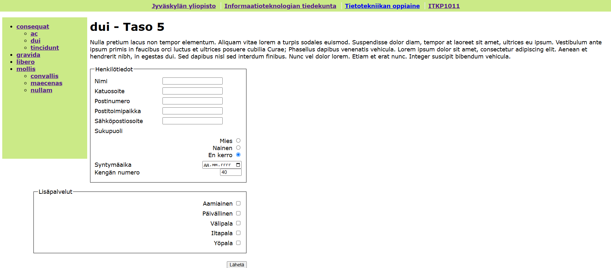
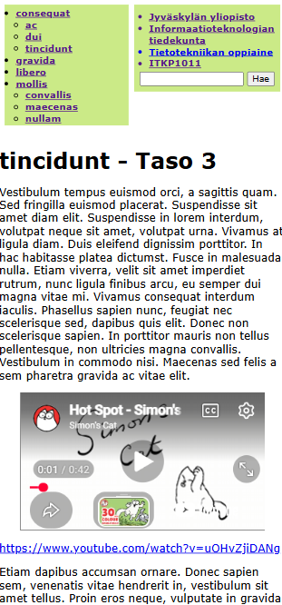
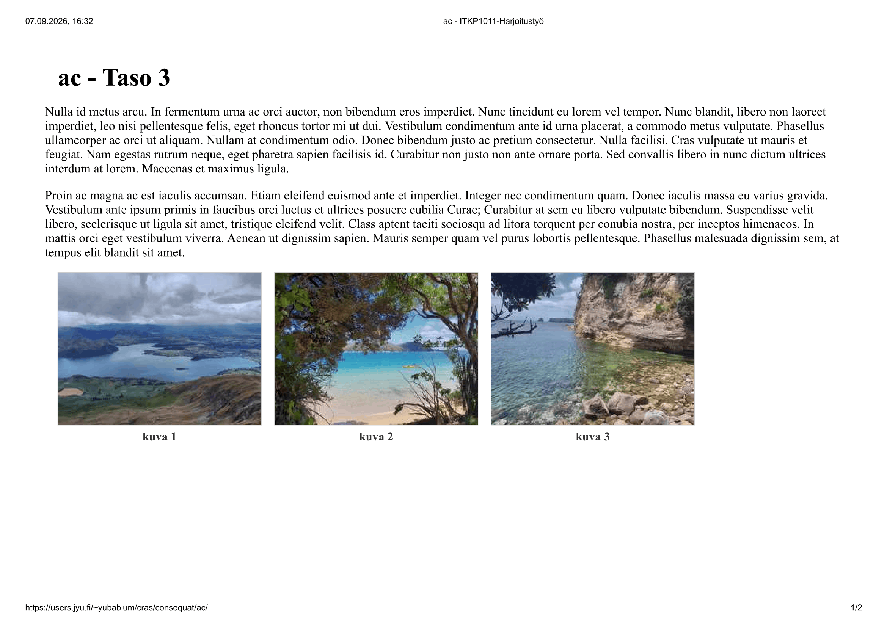

# JYU ITKP1011 — Web Project

A responsive frontend project created as part of the ITKP1011 Web-julkaiseminen course at the  [University of Jyväskylä (JYU) ](https://www.jyu.fi/fi).

The project is an independent student implementation based on the course assignment requirements, with a focus on clean structure, responsive layout and practical web standards.

## 🌐 Live site

**https://users.jyu.fi/~yubablum/cras/consequat/**

## ✨ Features

- Responsive layout for desktop and mobile screens
- Print-friendly styling
- Structured HTML5 markup
- CSS-based layout and presentation
- Relative navigation between pages
- Responsive media handling
- Image gallery
- Multimedia content
- Course-required navigation and page structure

## 🖼️ Screenshots

## 🛠️ Built with

- HTML5
- CSS3
- Responsive design
- Semantic web structure

## 🎓 Academic context

This project was developed as a university coursework project for **ITKP1011 — Web-julkaiseminen** at the [University of Jyväskylä](https://www.jyu.fi/fi).

The repository contains my implementation and code. The original course assignment, requirements and teaching materials are provided by JYU.

## 📌 Project status

Completed as a course project and hosted on the JYU web server.
